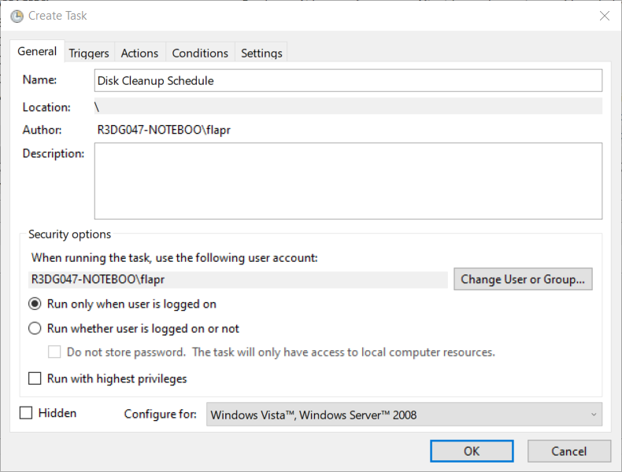

**Any operating system gets cluttered with temporary files** left out from updates, software installation and removal and software operations.
In addition to that, Microsoft Windows filesystems (FAT, FAT32, NTFS) historically suffer from **file fragmentation** issues.

An **automated maintenance** of the operating system is highly recommended. It frees the user from the burden of manually taking care of the system health, it keeps the system in good shape to help support user productivity activities and postpones eventual feared operating system refreshes.

This article strives to provide a free, lean and simple way of **automating Microsoft Windows operating system maintenance**. The following topics will be addressed: system and user software temporary files cleanup and disk defragmentation.

# Cleaning schedules to set up
## System temporary files cleanup
Microsoft Windows has come a long way at providing powerful and automated ways for taking care of temporary system files.

Windows 10 introduced the ["Storage Sense" solution](https://techcommunity.microsoft.com/t5/storage-at-microsoft/windows-10-and-storage-sense/ba-p/428270) which is aimed at providing a comprehensive and automated way of managing temporary files and superseeds the previous [Disk Cleanup utility](https://support.microsoft.com/en-us/help/4026616/windows-10-disk-cleanup) (now deprecated). This solution is publicized as a "superset of what the legacy Disk Cleanup provides" but it fails to provide a command line interface and a meaningful cleaning schedule. The clean schedule can be set, but it autonomously decides whether to clean or not at that given time based on hard drive free space and the amount of files to clean.

Fortunately for us Disk Cleanup utility is still provided even though deprecated. While waiting for a more "sensible" Storage Sense solution, Disk Cleanup powerful utility can be set to clean temporary system files in an automated way following a schedule.

1. run the [command prompt with elevated privileges](https://www.geeksinphoenix.com/blog/post/2015/06/10/how-to-open-a-command-prompt-with-administrator-privileges-in-windows-10.aspx)
2. run `cleanmgr /sageset:0` and from the "Disk Cleanup" tab select any file category you want to clean on schedule (personally I only leave out "Downloads" and "Recycle Bin" as I manually prefer to check them). To save the clean preferences click "OK". The command `cleanmgr /sageset:n` let define "Disk Cleanup" cleaning presets that can be run, without further user interaction, with the twin command `cleanmgr /sagerun:n`. A massive total of 65536 different cleanup profiles can be defined by appropriately setting the `n` option parameter in the range 0 to 65535.
3. run ["Task Scheduler"](https://en.wikipedia.org/wiki/Windows_Task_Scheduler) and click on "Create Task". A "Create Task" window will appear with several tabs:
    * **General**: set "Name" as "Disk Cleanup Schedule"
    * **Triggers**: add a trigger for the schedule by clicking "New..." and select how often you wish to run the cleanup schedule ("Weekly" should be fine, and select a day)
    * **Actions**: set "Action" to "Start a program", set "Program/script" to "cleanmgr" and "Add arguments (optional)" to `/sagerun:0`

## User software temporary files cleanup
Several tools for cleaning temporary files on Microsoft Windows exists, such as the famous [CCleaner](https://www.ccleaner.com/ccleaner).

A great, fully free and opensource alternative exists in [BleachBit](https://www.bleachbit.org). A great advantage of BleachBit over its freeware counterpart is the always up-to-date community curated list of "cleaners" (cleaning configurations) for a large number of software.

1. Download and install BleachBit from its official [website](https://www.bleachbit.org/download/windows)
2. run "BleachBit" check "Download and update cleaners from community (winapp2.ini)" in the preferences of the app.
3. select from the left pane of the app all the temporary files that wished to clean, for each of those a desription is provided. Personally most of the temporary files I checked are relative to web browsers, installed software and operative system related (under "System" and "Microsoft Windows"). Note that a useful "Preview" action allows to check what files would be deleted with the actual "Clean" action.
4. run ["Task Scheduler"](https://en.wikipedia.org/wiki/Windows_Task_Scheduler) and click on "Create Task". A "Create Task" window will appear with several tabs:
    * General: set "Name" as "BleachBit Schedule", check "Run with highest privileges"
    
    * Triggers: add a trigger for the schedule by clicking "New..." and select how often you wish to run the cleanup schedule ("Weekly" should be fine, and select a day)
    * Actions: set "Action" to "Start a program", set "Program/script" to `C:\Program Files (x86)\BleachBit\bleachbit_console.exe` (this is the installation folder of BleachBit) and "Add arguments (optional)" to `--no-uac --preset --clean --update-winapp2`
    
    
## Files defragmentation
Several tools for defragmenting files on Microsoft Windows exists, such as the built-in one [Windows Defragmenter](https://support.microsoft.com/en-us/help/4026701/windows-defragment-your-windows-10-pc).

A great, free and powerful alternative is [Defraggler](https://www.ccleaner.com/defraggler). Defraggler over its built-in counterpart is more featured and customizable. It has great visualization tools over benchmarks and the state of fragmentation of the drive, it allows to setup boot time and single folders defragmentations.

1. Download and install Defraggler from its official [website](https://www.ccleaner.com/defraggler/download/standard)
2. run "Defraggler" and click on "Schedule" to set up a schedule. A scheduled task will be created for you in the Windows ["Task Scheduler"](https://en.wikipedia.org/wiki/Windows_Task_Scheduler) with the desired settings (a Weekly schedule should suffice). Note that setting the cleaning scheduled tasks before the defragmentation would be beneficial as less files have to be defragmented.

# Conclusion
The description of a **"set and forget" schedule to maintain the responsiveness of a Microsoft Windows operating system** has been explained.

Main tools and software for Windows maintenance, and the Windows Scheduler have been described in the most essential parts with a focus on the features needed for this article.
The first schedule run will likely take some time and resources, but after it will become just part of the operating system routines, like software updates.

This article proposes a **starting point**, and an essential way on defining a basic maintenance routine for the Windows operating system which can be **customized as liked**.
