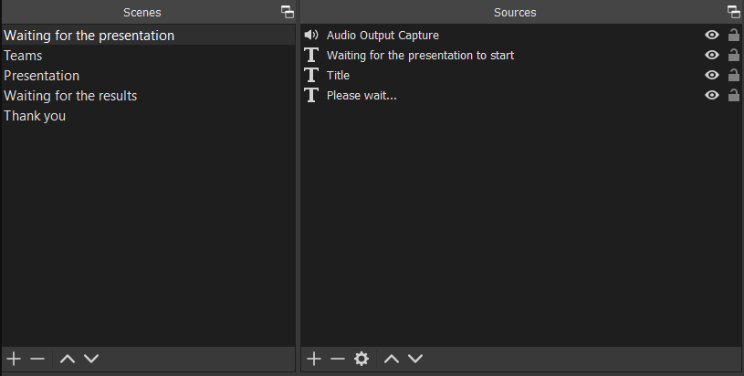
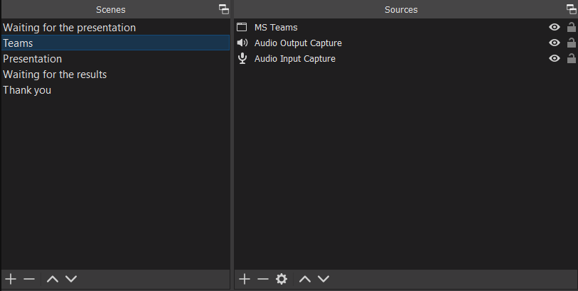
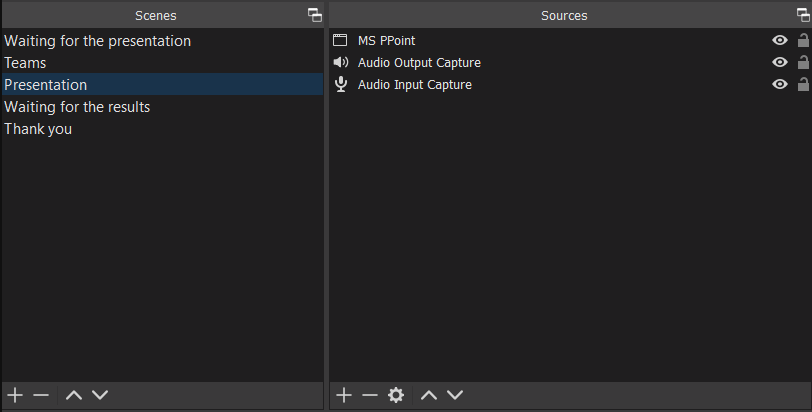
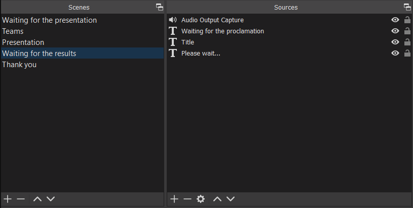

Thanks to [COVID 19 lockdown in Italy](https://en.wikipedia.org/wiki/COVID-19_pandemic_in_Italy), [Politecnico di Milano](https://www.polimi.it) decided to graduate students remotely using [Microsoft Teams](https://www.microsoft.com/microsoft-365/microsoft-teams/group-chat-software).

To let parents, relatives and friends to assist my graduation remotely, I decided to **stream the content of my graduation over a not listed direct stream over YouTube**.

Event though I've never streamed any content online before, I've found it relatively easy to set up an acceptable streaming configuration.

My requirements were:
*   **easy for people to view the streaming, without setting up an account and platform independent**: for this reason I opted for the [YouTube Studio streaming service](https://studio.youtube.com), which is, at the moment of writing, free to use, without limitations for desktop streaming source and compatible with third-party streaming software.
*   **a streaming software which is free, on device, easy to set-up, compatible with third-party streming services and possibly open-source**: for this task I chose [OBS Studio](https://obsproject.com). This is a free and open-source well-known software for multimedia streaming over the web. It is multiplatform as it supports all the major OSs (Windows, Linux and Mac) and compatible with many third party streaming services, including YouTube Studio.

# Instructions
I'll now describe the necessary steps for a satisfying streaming setup.

I advise to prepare well in advance as the YouTube account creation requires a couple of days (for verification purposes) and getting familiar with OBS and the streaming settings may take a while as it depends on your technical background and the available internet connection.
Please note that I'll only describe the major steps, as plenty (and even more updated in the future) of documentation is already available.

Without further ado let's see the instructions:
1. Register a [YouTube account](https://youtube.com) and [create a YouTube channel](https://support.google.com/youtube/answer/1646861), please note that this last step will take a couple of days, so prepare well in advance.
2. Once the YouTUbe channel has been activated, login into YouTube Studio and go to the "Live Streaming" section.
3. Create a new live stream setting its name, schedule and privacy settings ("not listed" means that the stream is accessible only to those having the link).
4. Once the Stream is created, set the latency (make some tests to find your optimal setting), set DVR (if you want to record the Stream), set "start automatically" (so that the stream will start when OBS starts the streaming) and get the "stream key" (it will be used by OBS Studio to connect to YouTube Studio). The spectator's streaming link can be obtained in the manage streams section of YouTube Studio.
5. Download and install [OBS Studio](https://obsproject.com) on the platform where the stream will take place.
6. Run OBS Studio and in the Settings paste the YouTube stream key and set the video bitrate (I've set mine to 3500 Kbs).

7. Set the appropriate "Scenes" for your streaming (official documentation [here](https://obsproject.com/wiki/Sources-Guide#scenes-and-sources-overview)).
Scenes are independent video/audio canvas configurations that can be alternatively selected to stream their content.
Each scene can be composed with video or audio element sources, such as: slideshows, texts, video source, window/screen sharing, desktop/microphone audio sharing. While streaming, select in real-time, the scene to stream.
Below are the scenes I created for my graduation.

8. To start the stream, open the OBS window, select the starting scene and click on "Start streaming", that's it!

# Notes
* an additional and interesting configuration with a [virtual webcam](https://obsproject.com/forum/resources/obs-virtualcam.949) is provided from [Collab365 YouTube channel](https://www.youtube.com/watch?v=ZXF0SW11udw)
* if streming Skype or other compatible content, a better option would be to use [NDI protocol](https://obsproject.com/forum/resources/obs-ndi-newtek-ndi%E2%84%A2-integration-into-obs-studio.528) if provided from [EposVox YouTube channel](https://www.youtube.com/watch?v=SmmHln-2kZw)
